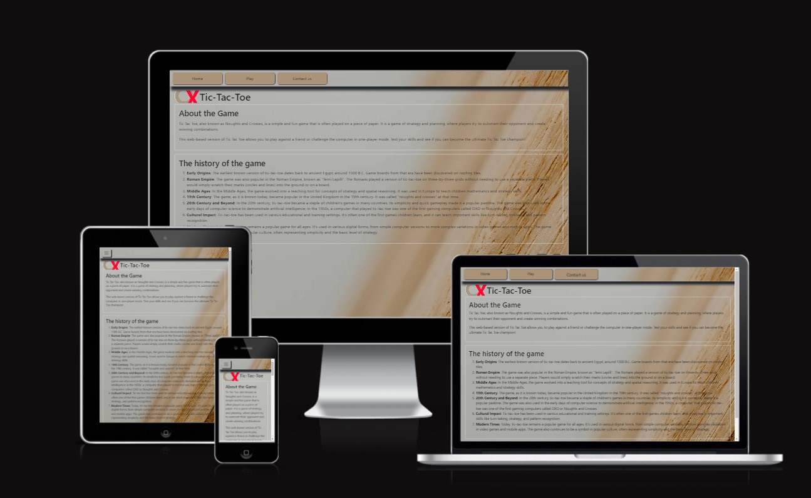

# Tic-Tac-Toe
(Developer: Sanor Smith)

[Live page]( https://sanorsmith.github.io/CI_PP2_Tic_Tac/ )

## Table of Content
#
0. [Introduction](#introduction)
1. [Project Goals](#project-goals)
    - [User Goals](#user-goals)
    - [Site Owner Objectives](#Site-Owner-Objectives)
2. [User Experience(UX)](#user-experienceux)
    - [Intended audience](#ideal-user)
    - [User Requirements and Expectations](#user-requirements-and-expectations)
    - [User Stories](#user-stories)
3. [Design](#design)
    - [ Chosen Design](#chosen-design)
    - [Wireframes](#wireframes)
    - [Colour](#colour)
    - [Fonts](#fonts)
    - [Structure](#structure)
    
4. [Technologies Used](#technologies-used)
    - [Primary Programming Languages Employed](#languages)
    - [Frameworks & Tools](#frameworks-libraries--programs-used)
5. [Features](#features)
     - [Existing-features](#existing-features) 
6. [Testing](#validation)
    - [HTML Validation](#html-validation)
    - [CSS Validation](#css-validation)
    - [Accessibility](#accessibility)
    - [Performance](#performance)
    - [Device testing](#device-testing)
    - [Browser compatibility](#browser-compatability)
    - [Testing user stories](#testing-user-stories)
8. [Bugs](#bugs)
9. [Deployment](#deployment)
   - [Deploying on GitHub pages](#deploying-on-github-pages)
   - [Local Development](#local-development)      
10. [Credits](#credits)
11. [Acknowledgments](#acknowledgments)

## Introduction

Tic-Tac-Toe is a classic two-player game on a 3x3 grid. Players take turns placing "X" or "O" in empty squares, aiming to form a line of three horizontally, vertically, or diagonally.

## Project Goals 
***

### User Goals
- Feel a sense of anticipation and satisfaction as you compete against an opponent, exercising strategic thinking in a simple yet enjoyable setting.
- Engaged, entertained, and perhaps a touch of competitive satisfaction, whether you win, lose, or draw.
-  Rediscover the joy and simplicity of a childhood game, fostering a nostalgic connection that adds a warm and comforting layer to the experience.

### Site Owner Objectives
- Provide a platform for users to enjoy a quick and entertaining game of Tic-Tac-Toe.
- Serve as a tool for users, especially younger audiences, to learn and develop strategic thinking skills.
- Increase website traffic and user acquisition by providing a simple, accessible game.
- Generate revenue through advertisements, in-app purchases, or premium features.

[Back to top &uarr;](#Tic-Tac-Toe)

User Experience (UX)
### Intended audience
- Individuals looking for easy-to-play, quick games to pass the time.
- Parents and children seeking family-friendly activities.
- Individuals reminiscing about classic games from their childhood.
- Users looking for social interactions through gaming.

### User Requirements and Expectations

- Ensure the website is accessible on various devices, especially mobile.
- Ensure the website loads quickly, and the game responds promptly.
- Use visually appealing graphics and design elements.
- Design the website to handle various user loads, especially during peak times.
- Include a feedback or contact form for users to report issues or provide suggestions.

### User Stories

- As a user, I want A clean and intuitive user interface with easy navigation.
- As a user, I expect to play the game seamlessly on their preferred devices.
- As a user, I can anticipate the ability to challenge others, fostering a social gaming experience.
- As a user, I can easily understand the rules and gameplay mechanics.
- As a user, I appreciate a visually pleasing interface that enhances the gaming experience.
- As a user, I should be able to access and play the game without interruptions, even during high traffic.
- As a user, I appreciate a platform that values their input and actively addresses concerns.

[Back to top &uarr;](#Tic-Tac-Toe)

## Design

### Design decisions
The design choices for the Tic-Tac-Toe game website focus on creating a visually appealing and user-friendly environment. Using a playful color palette and a minimalist interface, the design aims to evoke nostalgia and simplicity. The goal is to provide a joyful and inviting platform for users to enjoy a delightful gaming experience.

### Wireframes

***

- [Mobile-wireframes(pdf)](assets/docs/wireframes/mobile_wireframes.pdf)
- [Tablet-wireframes(pdf)](assets/docs/wireframes/tablet_wireframes.pdf)
- [Desktop-wireframes(pdf)](assets/docs/wireframes/desktop_wireframes.pdf)

### Colour
A subdued color scheme that imparts a vibrant and clean look to the website.

Colour palette

