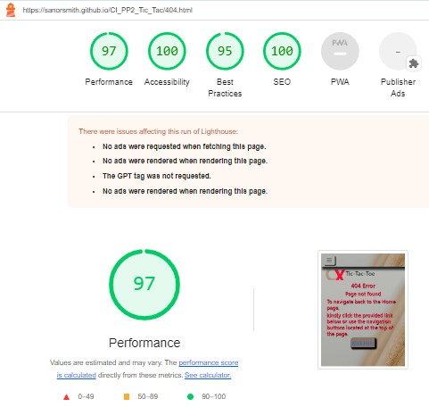

# Tic-Tac-Toe
(Developer: Sanor Smith)

[Live page]( https://sanorsmith.github.io/CI_PP2_Tic_Tac/ )

## Table of Content
#
0. [Introduction](#introduction)
1. [Project Goals](#project-goals)
    - [User Goals](#user-goals)
    - [Site Owner Objectives](#Site-Owner-Objectives)
2. [User Experience(UX)](#user-experienceux)
    - [Intended audience](#ideal-user)
    - [User Requirements and Expectations](#user-requirements-and-expectations)
    - [User Stories](#user-stories)
3. [Design](#design)
    - [ Chosen Design](#chosen-design)
    - [Wireframes](#wireframes)
    - [Colour](#colour)
    - [Fonts](#fonts)
    - [Structure](#structure)
    
4. [Technologies Used](#technologies-used)
    - [Primary Programming Languages Employed](#languages)
    - [Frameworks & Tools](#frameworks-libraries--programs-used)
5. [Features](#features)
     - [Existing-features](#existing-features) 
6. [Testing](#validation)
    - [HTML Validation](#html-validation)
    - [CSS Validation](#css-validation)
    - [JavaScript Validation](#javascript-validation)
    - [Accessibility](#accessibility)
    - [Performance](#performance)
    - [Device testing](#device-testing)
    - [Browser compatibility](#browser-compatability)
    - [Testing user stories](#testing-user-stories)
8. [Bugs](#bugs)
9. [Deployment](#deployment)
   - [Deploying on GitHub pages](#deploying-on-github-pages)
   - [Local Development](#local-development)      
10. [Credits](#credits)
11. [Acknowledgments](#acknowledgments)

## Introduction

Tic-Tac-Toe is a classic two-player game on a 3x3 grid. Players take turns placing "X" or "O" in empty squares, aiming to form a line of three horizontally, vertically, or diagonally.

## Project Goals 
***

### User Goals
- Feel a sense of anticipation and satisfaction as you compete against an opponent, exercising strategic thinking in a simple yet enjoyable setting.
- Engaged, entertained, and perhaps a touch of competitive satisfaction, whether you win, lose, or draw.
-  Rediscover the joy and simplicity of a childhood game, fostering a nostalgic connection that adds a warm and comforting layer to the experience.

### Site Owner Objectives
- Provide a platform for users to enjoy a quick and entertaining game of Tic-Tac-Toe.
- Serve as a tool for users, especially younger audiences, to learn and develop strategic thinking skills.
- Increase website traffic and user acquisition by providing a simple, accessible game.
- Generate revenue through advertisements, in-app purchases, or premium features.

[Back to top &uarr;](#Tic-Tac-Toe)

User Experience (UX)
### Intended audience
- Individuals looking for easy-to-play, quick games to pass the time.
- Parents and children seeking family-friendly activities.
- Individuals reminiscing about classic games from their childhood.
- Users looking for social interactions through gaming.

### User Requirements and Expectations

- Ensure the website is accessible on various devices, especially mobile.
- Ensure the website loads quickly, and the game responds promptly.
- Use visually appealing graphics and design elements.
- Design the website to handle various user loads, especially during peak times.
- Include a feedback or contact form for users to report issues or provide suggestions.

### User Stories

- As a user, I want A clean and intuitive user interface with easy navigation.
- As a user, I expect to play the game seamlessly on their preferred devices.
- As a user, I can anticipate the ability to challenge others, fostering a social gaming experience.
- As a user, I can easily understand the rules and gameplay mechanics.
- As a user, I appreciate a visually pleasing interface that enhances the gaming experience.
- As a user, I should be able to access and play the game without interruptions, even during high traffic.
- As a user, I appreciate a platform that values their input and actively addresses concerns.

[Back to top &uarr;](#Tic-Tac-Toe)

## Design

### Design decisions
The design choices for the Tic-Tac-Toe game website focus on creating a visually appealing and user-friendly environment. Using a playful color palette and a minimalist interface, the design aims to evoke nostalgia and simplicity. The goal is to provide a joyful and inviting platform for users to enjoy a delightful gaming experience.

### Wireframes

***

- [Mobile-wireframes(pdf)](assets/docs/wireframes/mobile_wireframes.pdf)
- [Tablet-wireframes(pdf)](assets/docs/wireframes/tablet_wireframes.pdf)
- [Desktop-wireframes(pdf)](assets/docs/wireframes/desktop_wireframes.pdf)

### Colour
A subdued color scheme that imparts a vibrant and clean look to the website.

Colour palette

### Fonts

Google fonts are used as follows:

- The website primarily employs the Oswald sans-serif font, which is integrated into the CSS file using the @import method.This font was selected for its compatibility with web body text, ensuring readability even at small sizes.

Google font

- The social-network icons utilizes the Font Awesome 6, which has been imported into the html through java-script. This font family was chosen for footer icons.

Font awesome

### Structure

In the website structure with one index file, CSS and JavaScript dynamically creates three different pages: Home, Play, and Contact Us. The index file serves as the main entry point for the website, and through JavaScript, it dynamically generates content for each page based on user interaction.

- Home Page: The default landing page when users visit the website. Provides an overview of the Tic-Tac-Toe game, with a brief introduction and game history.

- Play Page: Accessed when users click the "Start Game" button or a similar call-to-action on the Home page. Hosts the interactive Tic-Tac-Toe game, allowing users to play against another player or an AI opponent. Displays the game board, player information, and any relevant instructions.

- Contact Us Page: A page where users can reach out for support, provide feedback, or ask questions. Contains a contact form, email address, or other means of communication. Offers information about the development team or company behind the website.

## Technologies Used

### Languages
- HTML5
- CSS
- JavaScript 

### Frameworks Libraries & Programs Used
- GitHub
- Git
- Visual Studio Code
- Squoosh
- Photoshope
- Font Awesome
- Google Fonts
- Balsamiq
- Coolors
- lighthouse
- W3C Markup validation service
- W3C Jigsaw CSS validation service 
- jshint
- am i responsive
- WAVE WebAIM web accessibility evaluation tool
- Grammarly

[Back to top &uarr;](#Tic-Tac-Toe)

## Features

### Favicon
- The website includes a favicon, a small icon displayed in the browser tab or next to the website's name in bookmarks, which enhances branding and improves recognition.

Favicon

### Logo
- The site logo, which I personally designed using Photoshop, serves as a visual representation of the website's identity and brand.

Site Logo

### Navigation
- Both navigation systems are designed to be user-friendly, intuitive, and responsive across all screen sizes. A hamburger menu is utilized for mobile devices and screens up to 768px, while a sticky navigation bar is employed for screens larger than 768px. This setup provides users with a clear and seamless navigation experience, with links to specific sections of the website. On the desktop version, links are underlined and increase in size when hovered over, enhancing user engagement.

Desktop navbar

Mobile navbar

### Home
- The homepage consists of two sections: "About the Game" and "The History of the Game." Here's a brief overview of each section.In the "About the Game" section, you'll find everything you need to know about Tic-Tac-Toe. From its simple rules to its engaging gameplay, we've got you covered. Explore the rich heritage of Tic-Tac-Toe in our "History of the Game" section. Uncover its origins, cultural significance, and enduring popularity across generations.

Home

### Play
- In the "Play" section, users will find a prominent button to initiate the game and clear instructions on how to play.

Play

- The user has the option to select the number of players and decide between playing with a friend or against the computer. The computer's moves are determined using mathematical functions.

The number of players 

- At any point during the game, the user has the option to reset the board or restart the game.

Reset or Restart

### Contact us

- Contact Us feature on the game page providing users with a way to reach out for assistance, report any issues they encounter while playing, or offer feedback and suggestions to improve the gaming experience. 

Contact us

### Footer
- A social media segment featuring links to connect with the company, along with a trademark section showcasing the developer's name.

Footer

### 404 Message
- Offers users a method to navigate back to the game if they encounter a broken link.

404 Message

## Testing

### HTML Validation
Testing was conducted throughout the development process using Chrome Developer Tools and again upon project completion. The HTML of the website was validated using the W3C Markup Validation Service, and all code successfully passed without any errors.

Index.html

404 page

[Back to top &uarr;](#Tic-Tac-Toe)

### CSS Validation
The CSS code of the website was tested using the W3C Jigsaw CSS Validation Service, which confirmed that the code was error-free on the style.css file, on other hand it shows some errors with bootstrap v5.3.2 .

Full Page

style.css

### JavaScript Validation
The JavaScript files underwent validation using the JSHint Static Code Analysis Tool, revealing no notable issues.

javascript.js

### Accessibility

We used  WAVE WebAIM web accessibility evaluation service to ensure the project's high standards regarding accessibility.

Index

404-page

### Performance
I used Google Lighthouse in Google Chrome Developer Tools to test the performance of the project.

Website-Index-mobile

Website-Index-desktop

404.page-mobile

404.page-desktop

### Device testing
- Lenovo Legion T5AMR5
- Samsung A52, Galaxy 20, Ultra 
- Iphone 5,6,7,12,12pro,14Max-
- Ipad Air,Pro
 
 ### Browser Compatability 
 - Project was developed in the Google Chrome browser and then tested in:
 - Microsoft Edge
 - Mozilla Firefox

 [Back to top &uarr;](#Tic-Tac-Toe)

 ### Testing user stories

 0. As a New User,I want to easily to navigate the entire website intuitively.

| **Feature**                     | **Action**                          | **Expected Result**                                                                  | **Actual Result** |
|---------------------------------|-------------------------------------|--------------------------------------------------------------------------------------|-------------------|
|   Navigation                    | The initial section's navigation bar, or 'hamburger' menu, allows you to access any section of the page.| Users directed to their intended section. | Working as expected|
|   Sticky NAV-Bar                            | The navigation bar remains fixed at the top of the screen, ensuring that users are smoothly directed to their desired page | Jump to desired page| Working as expected|
|   Contact Us Section                     | Above the footer, users can click to initiate contact and submit their messages and details. | Efficiently reach out to the company, submit your message and relevant details." |Working as expected|
|   Footer                              | At the bottom of the website, users can navigate and connect through social networks |offering additional avenues for user interaction and engagement with the company. | Working as expected |

Screenshot/summary>

Screenshot

Screenshot

1. As a New User,I want to play the tic-tac game on website for pc and mobile devices anytime and anywhere.

| **Feature**                     | **Action**                          | **Expected Result**                                                                  | **Actual Result** |
|---------------------------------|-------------------------------------|--------------------------------------------------------------------------------------|-------------------|
|   Accessing the Tic-Tac-Toe Website   |  Open the browser and navigate to the Tic-Tac-Toe website. | The homepage of the Tic-Tac-Toe website loads successfully, displaying the navigation menu with options for "Home," "Play," and "Contact Us. | Working as expected|

Screenshot

2. As a New User,I want know the game and know the history of the game.

| **Feature**                     | **Action**                          | **Expected Result**                                                                  | **Actual Result** |
|---------------------------------|-------------------------------------|--------------------------------------------------------------------------------------|-------------------|
|   Exploring Home Page Sections   |  Click on the "Home" option in the navigation menu | The homepage displays two sections: "About the Game" and "Story of the Game. | Working as expected|

Screenshot

3. As a new user, you want to start the game quickly and learn how to play.

| **Feature**                     | **Action**                          | **Expected Result**                                                                  | **Actual Result** |
|---------------------------------|-------------------------------------|--------------------------------------------------------------------------------------|-------------------|
|    Starting the Game  |   Click on the "Play" option in the navigation menu. |  Upon clicking the "Play" option, the "Play" page loads, providing instructions on gameplay and a "Start" button. | Working as expected|

Screenshot

